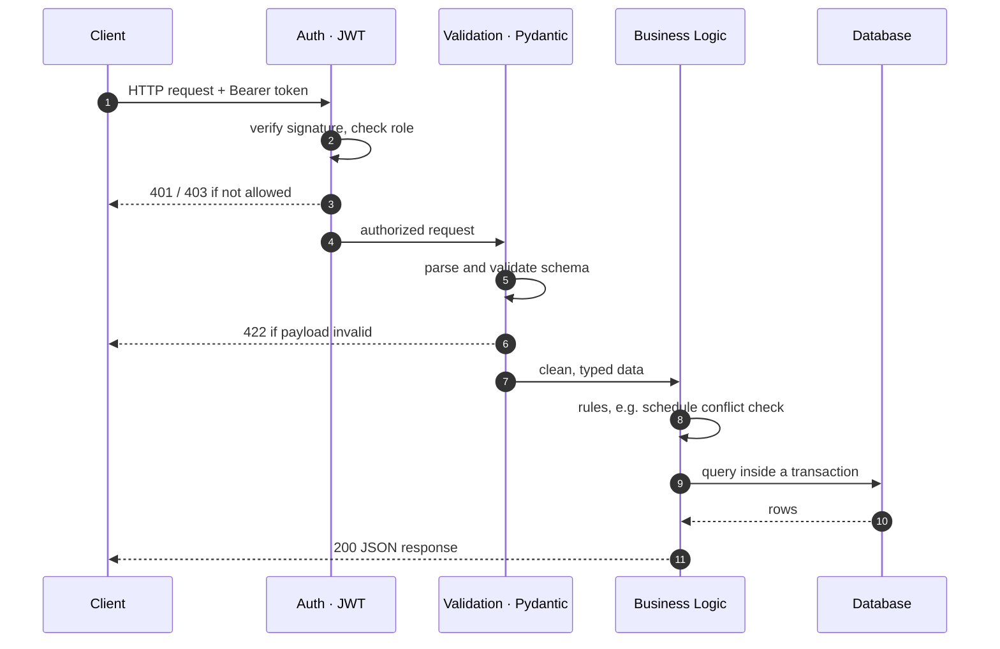
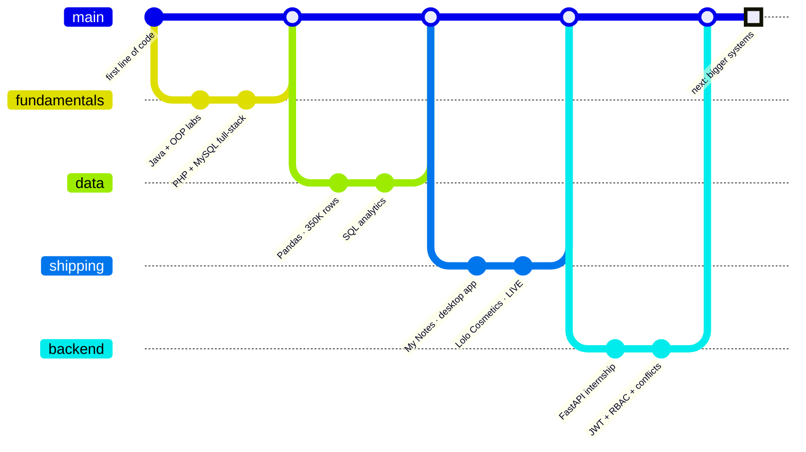

<p align="center">
  
</p>

<p align="center">
  <a href="https://www.linkedin.com/in/mohammed-shakarneh"></a>
  <a href="https://lolocosmetics.shop"></a>
  <a href="mailto:itshakarnehmohammed@gmail.com"></a>
  
</p>

---

## `GET` &nbsp;`/api/v1/developers/shakarneh`

```json
{
  "status": 200,
  "name": "Mohammed Shakarneh",
  "role": "Software Development Engineer",
  "focus": ["back-end", "REST APIs", "clean architecture"],
  "primary_stack": ["Python", "FastAPI", "SQLAlchemy", "PostgreSQL"],
  "also_ships": ["React", "TypeScript", "Supabase", "Cloudflare"],
  "experience": {
    "company": "Expert Choice CIS",
    "role": "Back-End Developer (Internship)",
    "built": "admin API — JWT auth, RBAC, CRUD, schedule conflict detection"
  },
  "in_production": "https://lolocosmetics.shop",
  "studying": "Software Engineering @ БГТУ им. В.Г. Шухова",
  "languages": ["Arabic (native)", "English", "Russian"],
  "currently_learning": ["OOP mastery", "clean code", "data structures & algorithms"],
  "open_to_work": true
}
```

---

## 🧭 How a request flows through the systems I build

> I can follow a request from the HTTP call through authentication, validation and business logic
> down to the database and back — and I know where it would break.



---

## 🗺️ My engineering journey, as a commit history



---

## 🛠️ Complete Tech Stack

**Languages**


**Back-End**


**Front-End**


**Databases & Cloud**


**Data & Analytics**


**Desktop & Packaging**


**Tools**


---

## 📌 Endpoints &nbsp;·&nbsp; my projects

| | Project | What it is | Stack |
|---|---|---|---|
| `200 LIVE` | **[Lolo Cosmetics](https://github.com/Shakarneh/lolo-cosmetics)** · [visit ↗](https://lolocosmetics.shop) | Production e-commerce for a real beauty brand — 267+ products, admin panel with analytics & review moderation, WhatsApp ordering, Arabic-first RTL | React · TypeScript · Vite · Supabase · Cloudflare |
| `201 BUILT` | **[Attendance Tracking System](https://github.com/Shakarneh/attendance-tracking-system)** | Back-end admin API for corporate training — JWT auth, role-based access, full CRUD, schedule conflict detection | Python · FastAPI · SQLAlchemy · SQLite |
| `201 BUILT` | **[AI Website](https://github.com/Shakarneh/AI-Website---Artificial-Intelligence)** | Full-stack site with session auth and an admin CRUD panel for users, pages, messages, reviews | PHP · MySQL · JavaScript |
| `200 SHIPPED` | **[My Notes](https://github.com/Shakarneh/My-Notes)** | Python-powered Windows desktop app — rich-text editor, Arabic RTL, dark/light themes, real installer | Python · PyInstaller · Inno Setup |
| `201 BUILT` | **[Java University Labs](https://github.com/Shakarneh/java-university-labs)** | OOP-focused Java labs — logging, regex, XML, MySQL | Java · MySQL |
| `201 BUILT` | **[Data Analysis](https://github.com/Shakarneh/covid-analysis)** | COVID-19 global analysis (350K-row Kaggle dataset), supermarket sales insights, SQL store analytics | Python · Pandas · Matplotlib · Jupyter |

---

## 📊 Stats

<p align="center">
  
</p>

<p align="center">
  
  
  
</p>

<p align="center">
  
</p>

<p align="center">
  
</p>

---

<p align="center"><i>💼 Open to back-end and full-stack software engineering opportunities.</i></p>


